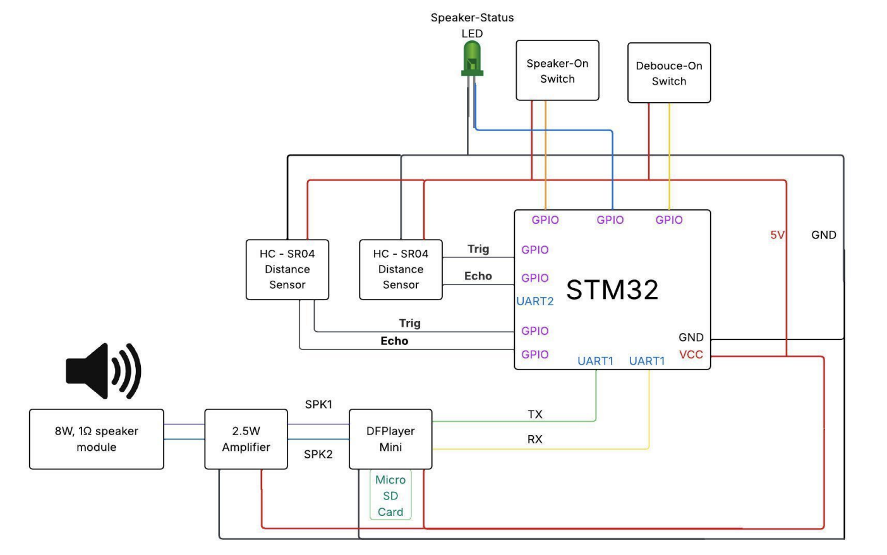

 # Candy_Controller
Proximity-based alarm system for entertainment purposes. Created as a final project for EE14 (Embedded Systems) at Tufts University.

&nbsp;&nbsp;&nbsp;&nbsp; The candy_controller is a halloween decoration you can put candy in, and when unsuspecting children come near to take some, a silly alarm will trigger to scare them

&nbsp;&nbsp;&nbsp;&nbsp; The Hardware used for this project was a STM32 Nucleo Board, a HC-SR04 Ultrasonic Distance Sensor, a DFPlayer Mini Module, and a Adafruit Mono 2.5W Audio Amplifier. The STM32 Nucleo Board handled input processing from the ultrasonic distance sensors to ensure that the alarm was triggered when a hand broke the open top of the box to reach for candy. Block Diagram provided below for the design.

